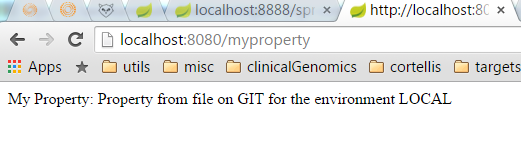

# Spring Cloud Config POC

Simple POC project with a client and server using Spring Cloud Config to store and access properties files simple visible for your micro-services.

## Pre Requisites

To use the encryption and decryption features you need the full-strength JCE installed in your JVM (it’s not there by default). You can download the ["Java Cryptography Extension (JCE) Unlimited Strength Jurisdiction Policy Files"](http://www.oracle.com/technetwork/java/javase/downloads/jce-7-download-432124.html) from Oracle, and follow instructions for installation (essentially replace the 2 policy files in the JRE lib/security directory with the ones that you downloaded).

## The modules

### Server

The properties files can be located on a GIT repository or on a local filesystem. Both options are mutually exclusive. To choose, you have to change the active profile on the bootstrap server:

      profiles:
        active: git

Profile "git" makes it search for files on the GIT location and profile "native" makes it search for local files. 

The use of local file system is unadvised for several reasons, but the main one (from the Spring documentation):
 
`The main reason is scalability (or availability depending on how you look at it). You need a reliable shared filesystem for the native profile in production - That's not impossible, but it isn't very cloudy.`

#### Properties files located on GIT:

The `spring-cloud-config-poc-server` module is a Spring Boot service that access the GIT repository: `https://git.sami.int.thomsonreuters.com/joan.tolos/ngs-config-files` where the properties files are stored.

On the `bootstrap.yml` file located on the resources folder, you can configure the git repository uri, user and password, and the possible extra sub-directories where the files are. In that case, I have included one folder for each environment.

When you start the server, you can access to the properties like this:

http://localhost:8888/{application}/{profile}

The {application} correspond to the application name and also the name of the file. So, if you try:

http://localhost:8888/spring-cloud-config-poc/local

You will access the file: {GIT}/spring-cloud-config-poc-local.properties

#### Properties files located on FILE SYSTEM:

Again, the use of local files on the filesystem is unadvised and it's not the best practice for Spring Cloud Conf:

`A filesystem backend is great for getting started quickly and for testing. To use it in production you need to be sure that the file system is reliable, and shared across all instances of the Config Server.`

If you want to use it anyway, you have to change the active profile on the server:

      profiles:
        active: native

### Client

On the client side, you only have to specify where is the config server on the `bootstrap.yml` file, and which environment are you on. For that, we will be using the environment variable: NG_ENV (Let's set the variable to "local" for that POC)

**IMPORTANT**

* The environment names (or profiles) can't contain dashes. So, it has to be ´devdtc´ instead of ´dev-dtc´
* The environment name has to match the content of the environment variable NG_ENV, the name of the folder on GIT and the end of the property file (example: spring-cloud-conf-poc- **devdtc**)

Then, on your client service, if you want to use a property, you only have to use the annotation @Value to link it:

    @Value("${my.property}")
    String my.property;

So, if you start the client service you can ping it:

http://localhost:8080/

And you can acces to the "my property" property:

http://localhost:8080/myproperty

Then, if you change the value of the environment variable NG_ENV to "devdtc" you will reach that:

Both cases correspond with the content of the properties files located on the GIT repository

### The config files

* For each environment we have a folder
* The file name has to match the application name which uses it
* The file has to end with "-environmentName"

### Security

You can protect the user and password of the git repository, actually you can encrypt all the properties you need so it's safe to store passwords.

If you are setting up a remote config repository for config client applications it might contain an application.yml like this, for instance:

    application.yml
    spring:
      datasource:
        username: dbuser
        password: '{cipher}FKSAJDFGYOS8F7GLHAKERGFHLSAJ'
    
You can safely push this plain text to a shared git repository and the secret password is protected.

The server also exposes /encrypt and /decrypt endpoints (on the assumption that these will be secured and only accessed by authorized agents). If you are editing a remote config file you can use the Config Server to encrypt values by POSTing to the /encrypt endpoint, e.g.

    $ curl localhost:8888/encrypt -d mysecret
    682bc583f4641835fa2db009355293665d2647dade3375c0ee201de2a49f7bda

The inverse operation is also available via /decrypt (provided the server is configured with a symmetric key or a full key pair):

    $ curl localhost:8888/decrypt -d 682bc583f4641835fa2db009355293665d2647dade3375c0ee201de2a49f7bda
    mysecret

Take the encrypted value and add the {cipher} prefix before you put it in the YAML or properties file, and before you commit and push it to a remote, potentially insecure store. The /encrypt and /decrypt endpoints also both accept paths of the form /*/{name}/{profiles} which can be used to control cryptography per application (name) and profile when clients call into the main Environment resource.

## Exploring the server

This is the architecture (from Spring documentation):

So, the config server provide a series of services that we can use to update and refresh properties.

## More information

[Spring Cloud Config](http://cloud.spring.io/spring-cloud-config/spring-cloud-config.html#config-client-fail-fast)